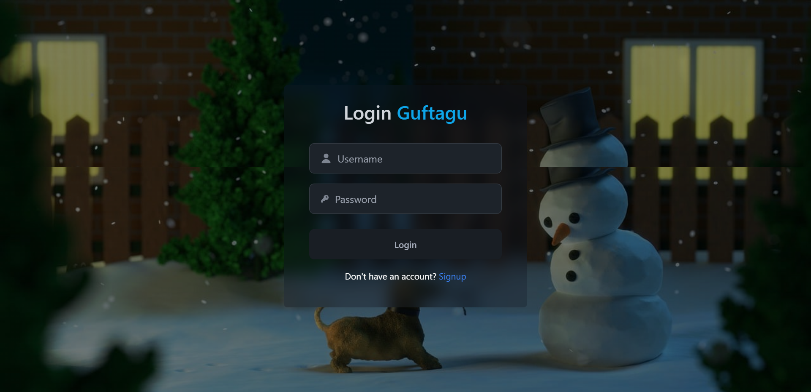
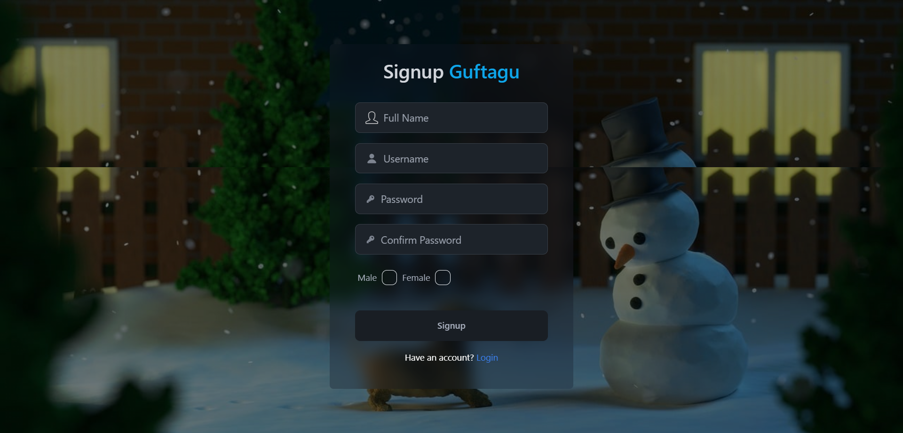
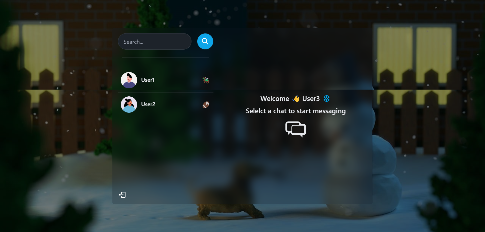
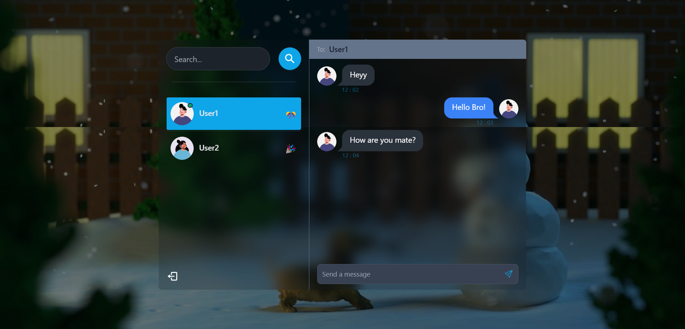
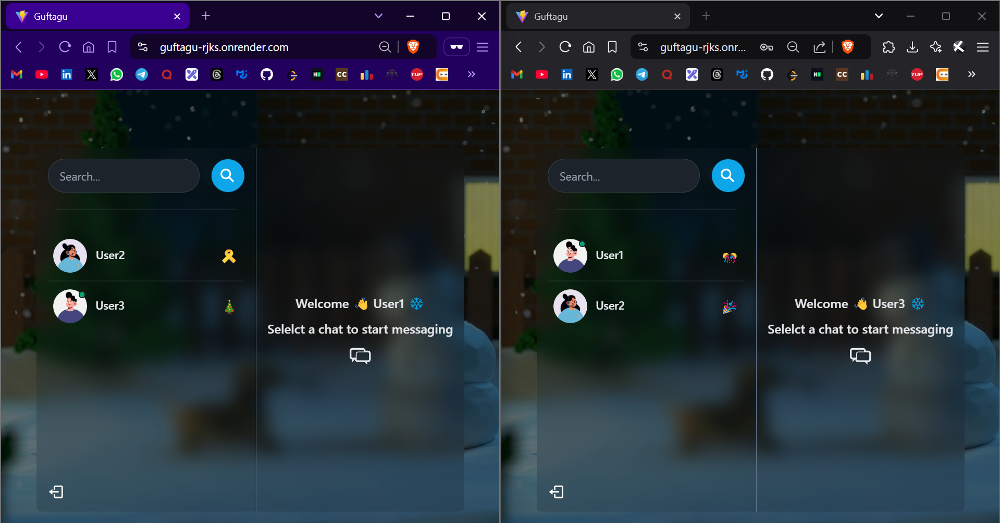
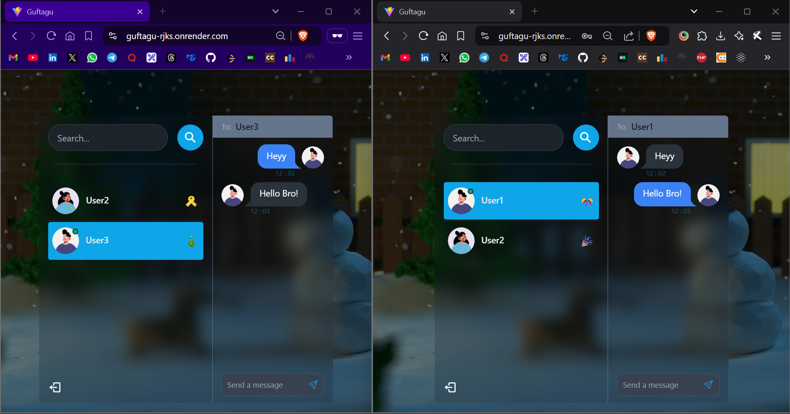

# 🌟 Guftagu: Real-Time Chat Application

## 🌐 Overview
Guftagu is a full-stack real-time messaging application designed to provide seamless communication between users. It features real-time updates, intuitive UI components, and scalable backend technologies to ensure a smooth and engaging user experience.

---

## ✨ Features

### 🎨 Frontend
- Built using **React.js** for a responsive and interactive user interface.
- Intuitive navigation for better user experience.
- Real-time online/offline status updates for users.

### 🛠️ Backend
- Developed with **Node.js** and **Express.js** for handling API routes and real-time socket communication.
- **Socket.IO** integration for instant message delivery and event-based communication.
- User authentication and authorization implemented with **JWT (JSON Web Tokens)**.

### 🗄️ Database
- **MongoDB** database for efficient storage and retrieval of user data, messages, and conversation history.
- Optimized database queries for performance.

### 🚀 Deployment
- Deployed on **render.com**, ensuring high availability and scalability.
- Supports cross-origin communication and secure data handling.

---

## 🛠️ Technical Stack

- **Frontend**: React.js, CSS, Zustand (state management)
- **Backend**: Node.js, Express.js, Socket.IO
- **Database**: MongoDB
- **Deployment**: Hosted on Render.com ([View Live Project](https://guftagu-rjks.onrender.com/login))

---

## 🔑 Key Functionalities

1. **💬 Real-Time Messaging**: Instant communication powered by Socket.IO.
2. **📂 Conversation Management**: Users can start and maintain conversations efficiently.
3. **🔔 Message Notifications**: Real-time notifications for new messages.
4. **🟢 Dynamic Online Users**: Display of currently online users updated in real time.
5. **🔒 Authentication**: Secure login and user session handling with JWT.

---

## 🖥️ How to Run Locally

### 📋 Prerequisites
- Node.js and npm installed.
- MongoDB instance running locally or remotely.

### 🛠️ Steps
1. Clone the repository:
   ```bash
   git clone [repository-url]

2. Navigate to the project directory:
   ```bash
   cd ChatApp

3. Install dependencies for both frontend and backend:
   ```bash
   cd backend
   npm install
   cd ../frontend
   npm install

4. Set up environment variables:
   • Create a .env file in the backend folder with the following:
   ```bash
   PORT=5000
   MONGO_URI=your_mongodb_connection_string
   JWT_SECRET=your_jwt_secret

5. Start the backend server:
   ```bash
   cd backend
   npm start

6. Start the frontend development server:
   ```bash
   cd ../frontend
   npm start

7. Open your browser and visit:
   ```bash
   http://localhost:3000


### 🚀 Deployment Steps
1. Deploy the backend to Render.com.

2. Deploy the frontend to Render.com.

3. Ensure proper environment variable configurations on both platforms.

### 🔮 Future Improvements
1. Add multimedia support for messages (images, videos, etc.).

2. Implement group chats and broadcasting features.

3. Enhance the UI with animations and themes.

4. Integrate a notification system for offline message alerts.

5. Updtae the User tab dynamicaaly according to the latest message.

### 📸 Screenshots

#### Login Page


#### SignUp Page


#### Home Interface


#### Chat Interface


#### Online Users Home Interface


#### Online Users Chat Conversation Interface


### 📜 License
This project is licensed under the [LICENSE.md](LICENSE.md) file. See the LICENSE.md file for details.


